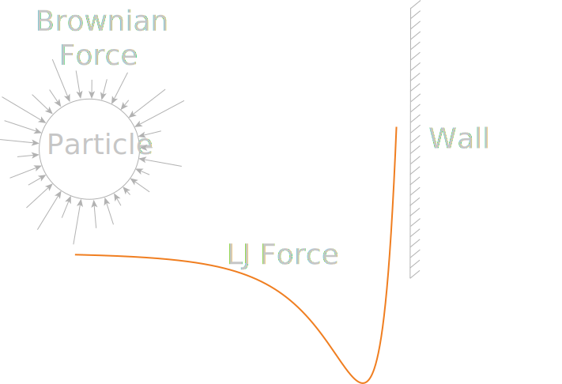

# Langevin solver


## Description
This program simulates a point particle in water in front of an 
LJ wall using the Langevin equations of motion in 1-D. The LJ and
Brownian forces may be calculated using equations, or
interpolated from a file. 

The LJ force is calculated using the 12-6 form of the LJ 
potential. The interpolation file for the same needs to 
provide particle-wall distance and corresponding force. A sample
file, 'wallf.txt' is provided. The wall location is set
to 0.

Brownian forces are calculated from the equations described
in [Casanova 2020](https://pubs.rsc.org/en/content/articlelanding/2020/NR/D0NR04058D)
or from a file containing time series of Brownian forces
computed from MD or otherwise. A sample file, 'brownianf.txt'
is provided.

To compile: 
```
g++ langevin_solver.cpp
```
To run:
```
./a.out
```
Output is dumped to the file 'output.txt'. The columns of 
'output.txt' correspond to timestep, particle position,
particle velocity and total force on particle in [LAMMPS
real units](https://docs.lammps.org/units.html). 
